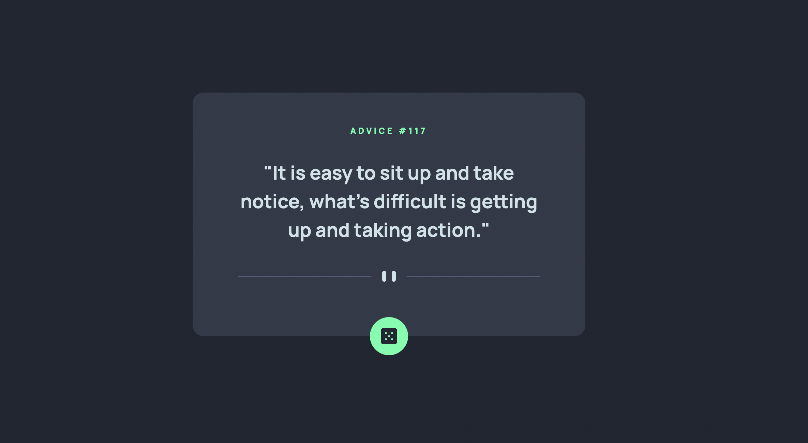

# Frontend Mentor - Advice Generator App Solution

This is a solution to the [Advice generator app challenge on Frontend Mentor](https://www.frontendmentor.io/challenges/advice-generator-app-QdUG-13db). Frontend Mentor challenges help you improve your coding skills by building realistic projects.

### Links

- Live Demo URL: [https://badu-fmc.netlify.app/advice-generator](https://badu-fmc.netlify.app/advice-generator)
- Solution URL: [https://www.frontendmentor.io/solutions/advice-generator-app-with-svelte-and-tailwindcss-uV11qWtAy](https://www.frontendmentor.io/solutions/advice-generator-app-with-svelte-and-tailwindcss-uV11qWtAy)

# Overview

### Challenge

Users should be able to:

- View the optimal layout for the app depending on their device's screen size
- See hover states for all interactive elements on the page
- Generate a new piece of advice by clicking the dice icon

This was my first challenge on Frontend Mentor. Since I have experience with both Svelte and TailwindCSS, I chose to use them. Rather than updating global Tailwind files, I wrote custom CSS in the component, when needed, so the styles could be kept local. All of my solutions will be housed in the same SvelteKit app, and this will prevent conflicting styles in the future.

## Author

- Twitter - [@badublanc](https://www.twitter.com/badublanc)
- Frontend Mentor - [@badublanc](https://www.frontendmentor.io/profile/badublanc)
