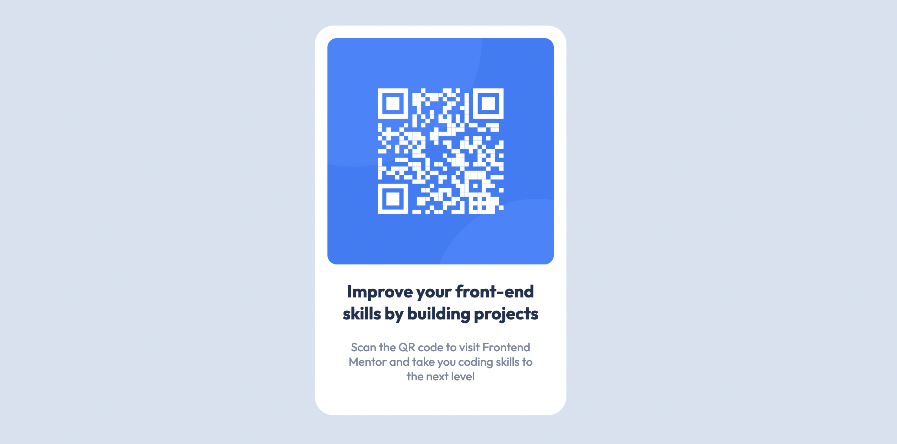

# Frontend Mentor - QR Code Component Solution

This is a solution to the [QR code component challenge on Frontend Mentor](https://www.frontendmentor.io/challenges/qr-code-component-iux_sIO_H). Frontend Mentor challenges help you improve your coding skills by building realistic projects.

### Links

- Live Demo URL: [https://badu-fmc.netlify.app/qr-code](https://badu-fmc.netlify.app/qr-code)
- Solution URL: [https://www.frontendmentor.io/solutions/qr-code-component-svelte-and-tailwindcss-_Jm2_YD9_](https://www.frontendmentor.io/solutions/qr-code-component-svelte-and-tailwindcss-_Jm2_YD9_)

## Author

- Twitter - [@badublanc](https://www.twitter.com/badublanc)
- Frontend Mentor - [@badublanc](https://www.frontendmentor.io/profile/badublanc)
